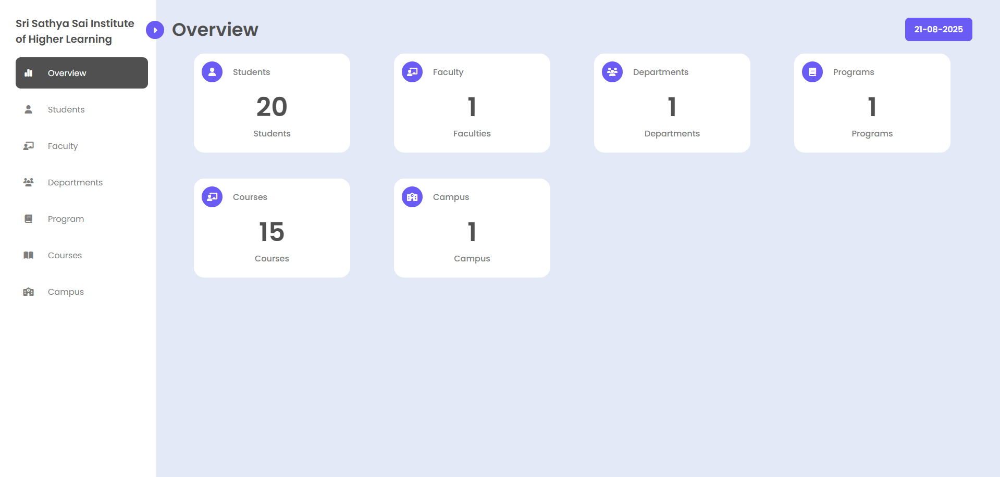
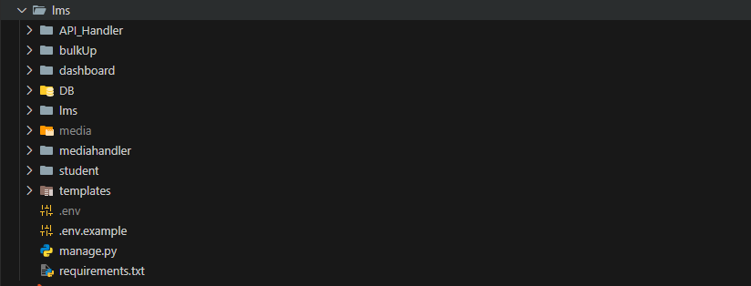
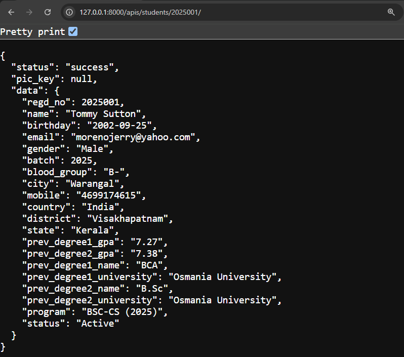

# FULL-STACK-PROJECT Documentation


> **Tip:** You can add screenshots or diagrams to visually enhance this documentation. See suggested places below.

## Tech Stack

- **Backend Framework:** Django (Python)
- **Database:** SQLite (default) or configurable in `settings.py`
- **Frontend:** Django Templates (HTML), CSS, JavaScript
- **Media Handling:** Django's built-in media management
- **Environment Management:** `.env` files
- **Testing:** Django's test framework (`tests.py` in each app)
- **Admin Interface:** Django Admin

---

## Project Structure

```
lms/
│   manage.py
│   requirements.txt
│   .env / .env.example
│
├── API_Handler/
├── bulkUp/
├── dashboard/
├── DB/
├── lms/
├── media/
├── mediahandler/
├── student/
└── templates/
```


> **Add Image Here:**
> - Screenshot of your project folder structure in VS Code or file explorer.

---

## Django Apps Overview & Functioning

### 1. API_Handler
**Purpose:** Exposes data and operations via RESTful APIs for integration and automation.

**Key Components:**
- `models.py`: Defines API-exposed data models (e.g., Course, Student, Faculty).
- `views.py`: Contains logic for handling API requests, authentication, and data serialization.
- `urls.py`: Maps API endpoints to views, often using RESTful patterns.
- `admin.py`: Registers models for admin management.
- `tests.py`: Unit tests for API endpoints and data integrity.

**Typical Workflow:**
1. Client sends HTTP request to an API endpoint.
2. `urls.py` routes the request to the appropriate view.
3. `views.py` processes the request, interacts with `models.py` for data operations.
4. Data is serialized (using Django REST Framework if installed) and returned as JSON.
5. Used for mobile apps, frontend SPAs, or third-party integrations.


> **Add Image Here:**
> - Example screenshot of API response in Postman or browser.
> - Diagram showing API flow (request → view → model → response).

### 2. bulkUp
**Purpose:** Handles bulk data uploads (e.g., students, courses) and error reporting for mass operations.

**Key Components:**
- `models.py`: Models for bulk upload records and error logs.
- `views.py`: Logic for file upload, validation, and processing.
- `utils.py`: Helper functions for parsing files (CSV, Excel), validating data, and error handling.
- `templates/`: HTML templates for error display (`Error-Handler.html`) and PDF generation (`Error-PDF.html`).

**Typical Workflow:**
1. User uploads a bulk data file via a form.
2. `views.py` receives the file and passes it to `utils.py` for parsing and validation.
3. Valid records are saved to the database; errors are logged and displayed using templates.
4. Optionally, error reports or PDFs are generated for failed uploads.
5. Used for onboarding large datasets efficiently.

> **Add Image Here:**
> - Screenshot of bulk upload form.
> - Example error report or PDF generated by the app.

### 3. dashboard
**Purpose:** Main admin and management interface for all LMS entities (courses, departments, faculty, students).

**Key Components:**
- `models.py`: Models for all dashboard entities (Course, Department, Faculty, Student, etc.).
- `views.py`: Handles CRUD operations, dashboard logic, and data aggregation for overviews.
- `urls.py`: Maps dashboard pages and actions to views.
- `static/`: CSS, JS, and images for dashboard UI.
- `templates/`: HTML templates for add/edit/view pages, overviews, and uploads.

**Typical Workflow:**
1. Admin accesses dashboard via mapped URLs.
2. `views.py` fetches or updates data using `models.py`.
3. Data is rendered in templates, styled with static files.
4. Supports adding/editing/viewing courses, departments, faculty, students, and more.
5. Provides overviews and statistics for management.

> **Add Image Here:**
> - Screenshot of dashboard home page or entity management page (e.g., Add Course, Overview).

### 4. DB
**Purpose:** Advanced database management, custom admin features, and backend data operations.

**Key Components:**
- `models.py`, `models.all.py`: Core and extended database models for complex data relationships.
- `admin.py`, `admin.all.py`: Custom admin configurations for advanced data management.
- `views.py`: Views for backend operations, bulk actions, and custom queries.
- `urls.py`: Routes for DB-related features.

**Typical Workflow:**
1. Admins use custom views for advanced data queries and bulk operations.
2. Extended models and admin features allow for flexible data management.
3. Used for backend tasks that go beyond standard CRUD, such as batch updates or custom reports.

> **Add Image Here:**
> - Screenshot of custom admin view or advanced database management interface.

### 5. lms (Core Project)
**Purpose:** Central configuration, routing, and entry points for the Django project.

**Key Components:**
- `settings.py`: Configures installed apps, middleware, database, static/media paths, authentication, and more.
- `urls.py`: Root URL configuration, includes all app URLs for request routing.
- `asgi.py`, `wsgi.py`: Entry points for running the server (ASGI/WGI).
- `__init__.py`: Marks the directory as a Python package.

**Typical Workflow:**
1. All requests are routed through `urls.py` to the appropriate app.
2. `settings.py` manages global configuration and environment variables.
3. Entry points are used for deployment and server management.

> **Add Image Here:**
> - Diagram of request routing (showing how URLs are mapped to apps).

### 6. mediahandler
**Purpose:** Handles file uploads, media storage, and processing for the LMS.

**Key Components:**
- `models.py`: Models for storing file metadata (name, path, type, uploader).
- `forms.py`: Django forms for file upload and validation.
- `views.py`: Logic for receiving, validating, and saving files.
- `utils.py`: Helper functions for processing files (e.g., resizing images, converting formats).
- `templates/`: HTML templates for media upload pages.

**Typical Workflow:**
1. User uploads a file via a form rendered from `forms.py` and `templates/`.
2. `views.py` validates the file type and size, then saves it to `media/uploads/`.
3. File metadata is stored in the database via `models.py`.
4. `utils.py` may process the file (e.g., image resizing, format conversion).
5. Files are served to users via Django's media URL configuration.
6. Other apps (dashboard, student) can reference or display uploaded files (e.g., profile pictures, course materials).

> **Add Image Here:**
> - Screenshot of media upload form.
> - Example of uploaded file listing or preview.

### 7. student
**Purpose:** Manages student data, registration, profiles, and progress tracking.

**Key Components:**
- `models.py`: Models for student profiles, enrollment, progress, and related data.
- `views.py`: Logic for student registration, profile management, and progress tracking.
- `urls.py`: Routes for student actions (register, update profile, view progress).
- `templates/`: HTML templates for student forms and profile pages.

**Typical Workflow:**
1. Student registers or updates profile via forms/views.
2. Data is validated and stored in the database using `models.py`.
3. `views.py` manages registration, updates, and progress display.
4. URLs map student actions to the correct views and templates.
5. Student data is used by other apps (dashboard, API_Handler) for management and reporting.

> **Add Image Here:**
> - Screenshot of student registration or profile page.
> - Example of student progress tracking UI.

---

## How Apps Interact
- **dashboard** uses **mediahandler** to attach files to courses, faculty, or students.
- **bulkUp** may use **mediahandler** for bulk file uploads.
- **API_Handler** can expose media URLs or data for frontend consumption.
- **student** app can display profile pictures or documents uploaded via **mediahandler**.

---

## Running & Developing
1. Install dependencies:
   ```
   pip install -r requirements.txt
   ```
2. Configure environment variables in `.env`.
3. Run migrations:
   ```
   python manage.py migrate
   ```
4. Start the server:
   ```
   python manage.py runserver
   ```
5. Access the admin interface at `/admin/`.

---

## Contribution & Best Practices
- Keep each app modular and focused on a single domain.
- Use Django's built-in admin and testing tools.
- Organize static and template files within each app.
- Document new models, views, and utilities.
- Write tests for new features in `tests.py`.

---

If you need a deeper dive into any app or feature, specify which one and what details you need!
